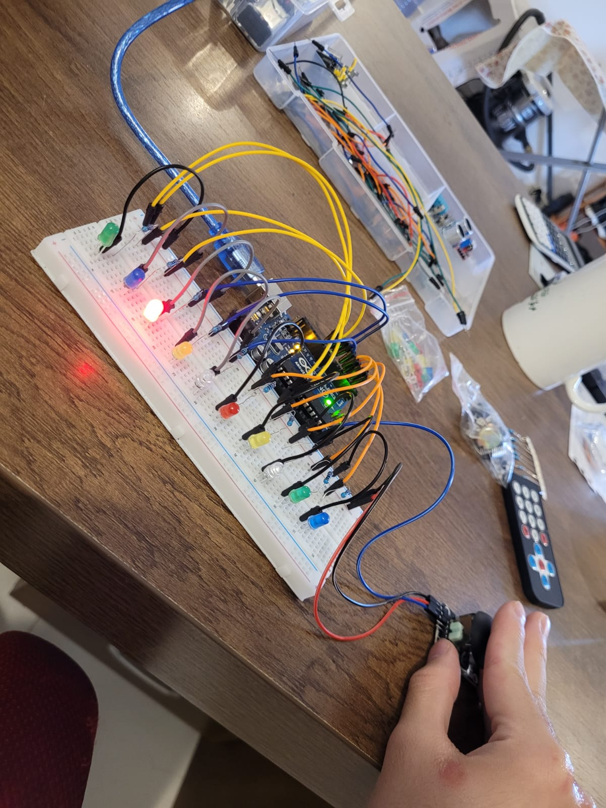
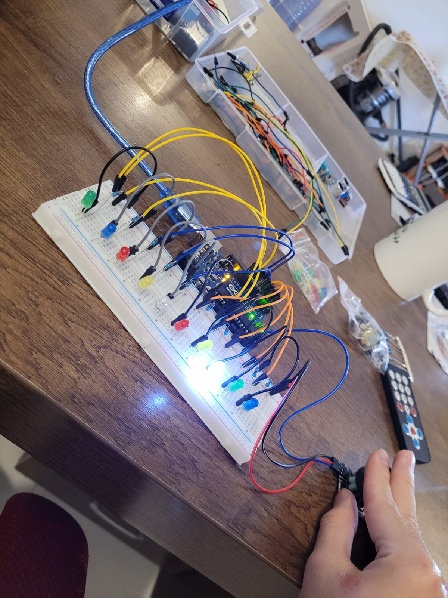

# Arduino---controlling-LED-joyStick


# Description:
Arduino---Joystick-Controlled-LED-Bar

This project uses an Arduino, a joystick module, and 10 LEDs to create a dynamic LED bar that lights up based on the joystick's horizontal movement.

---

How it works:

The joystick reads the analog X-axis value.

As the joystick moves to the right, more LEDs from left to right light up in sequence.

As the joystick moves to the left, more LEDs from right to left light up.

When the joystick is in the center, only the middle LED is turned ON to indicate a neutral position.

The system provides real-time visual feedback that changes smoothly as you move the joystick.

---

This project is a great demonstration of how to map analog input values to control multiple digital outputs. It's perfect for learning how to build interactive LED displays or real-time feedback systems using Arduino.


# Picture:





# Code Below:
```cpp
byte LED1 = 2;
byte LED2 = 3;
byte LED3 = 4;
byte LED4 = 5;
byte LED5 = 6;
byte LED6 = 7;
byte LED7 = 8;
byte LED8 = 9;
byte LED9 = 10;
byte LED10 = 11;
int pinX = A5;


byte LEDOn;
byte lastLED;
int joyRead;


void setup() {
  Serial.begin(9600);

  for (byte i; i<11; i++)
  pinMode(i, OUTPUT);
}

void loop() {
  joyRead = analogRead(pinX);

  LEDOn = map(joyRead, 0, 1023, 11, 2);

  if (LEDOn != lastLED && lastLED >= 2 && lastLED <= 11){
    digitalWrite(LEDOn, HIGH);
    digitalWrite(lastLED, LOW);
  }

  lastLED = LEDOn;


  Serial.println(pinX);
  Serial.println(lastLED);


  delay(30);
}
```
